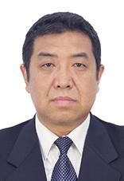

   
   

# **Lin Haibo's Research Team at Jilin University**

Welcome to the official GitHub page of Professor Lin Haibo’s research team at Jilin University! We are a multidisciplinary team of scientists, engineers, and researchers working on cutting-edge electrochemical technologies for environmental governance, clean production, and energy conversion.

## **About the Team**

Our team is a collaboration between Jilin University, industry partners, and international researchers, focused on innovative electrochemical solutions. We have established a comprehensive research platform, ranging from fundamental science to technology development and application. With a strong emphasis on the integration of carbon materials, advanced energy storage devices, and electrochemical systems, our work addresses key challenges in energy conversion, storage, and environmental sustainability.

The team is composed of:

- **4 young professors**
- **3 engineers**
- **20+ graduate students (PhD and Master’s levels)**

We are committed to driving forward both basic research and industrial applications, with a strong track record in technology transfer and commercialization.

### **Research Focus**
Our main research directions include:

- **Electrochemical Engineering**: Developing new electrode materials and electrochemical reactors for energy storage and conversion.
- **Electrocatalysis & Electrosynthesis**: Advancing electrocatalytic processes for sustainable energy solutions.
- **Environmental Electrochemistry**: Applying electrochemical technologies for environmental cleanup and waste treatment.
- **Advanced Aqueous Battery Technologies**: Innovating in the field of aqueous-based energy storage systems.

### **Key Contributions**
Over the years, our team has made significant contributions in the following areas:

1. **Titanium-Based Electrode Materials**  
   We uncovered the long-lasting nature of multi-layered titanium-based electrodes, enhancing performance through optimized porous structures. This discovery is key to improving the durability of electrochemical devices such as batteries and fuel cells.

2. **Green Production of Rice Husk-Based Capacitive Carbon**  
   We developed an innovative, environmentally friendly process to produce high-performance capacitive carbon from rice husks. This process introduces a multi-level pore structure and self-template technology, creating a sustainable method for producing supercapacitor materials. The technology has been successfully commercialized, leading to large-scale production lines for rice husk-based carbon materials, contributing to the domestic production of supercapacitors and lead-carbon batteries.

3. **Lead-Carbon Batteries**  
   Our research into the electrochemical behaviors of lead-carbon batteries has revealed critical insights into improving charging efficiency and energy storage performance, advancing the development of lead-acid battery technologies.

### **Collaborations and Industry Partnerships**
We have established strong collaborations with leading academic institutions and industry partners around the world. Some of our key collaborations include:

- **Industry Partners**: Jiangsu Shuangdeng Group, Kunming Technology, Guangdong Zhicheng Champion, and more.
- **Academic Partners**: Hong Kong University of Science and Technology, University of Brunswick, King Saud University, and others.
- **Standardization and Advisory Roles**: We play an active role in shaping the future of lead-acid battery technologies through our involvement in national standards organizations and industry associations.

### **Our Achievements**
- **Innovation in Green Technology**: Successfully transferred patents for green production processes of capacitive carbon, which are now industrialized.
- **Awards**: Our work has been recognized by Xinhua News Agency and awarded the **2019 Jilin Province Excellent Patent Award**.
- **International Presence**: Our team regularly participates in prestigious conferences such as the **International Electrochemical Society (ISE)** and **International Lead-Acid Battery (LABAT) Conferences**.

### **Join Us**
We welcome collaboration with researchers, industry professionals, and innovators. Our GitHub organization hosts various open-source projects, research papers, and tools developed by our team. Feel free to explore our repositories, contribute to our ongoing research, or reach out for potential collaborations.

   
   

Email: jluelectrochem@163.com

Postal Code: 130012

---

Thank you for visiting our page! We look forward to engaging with the global scientific and technical community to continue advancing the field of electrochemical technologies.
